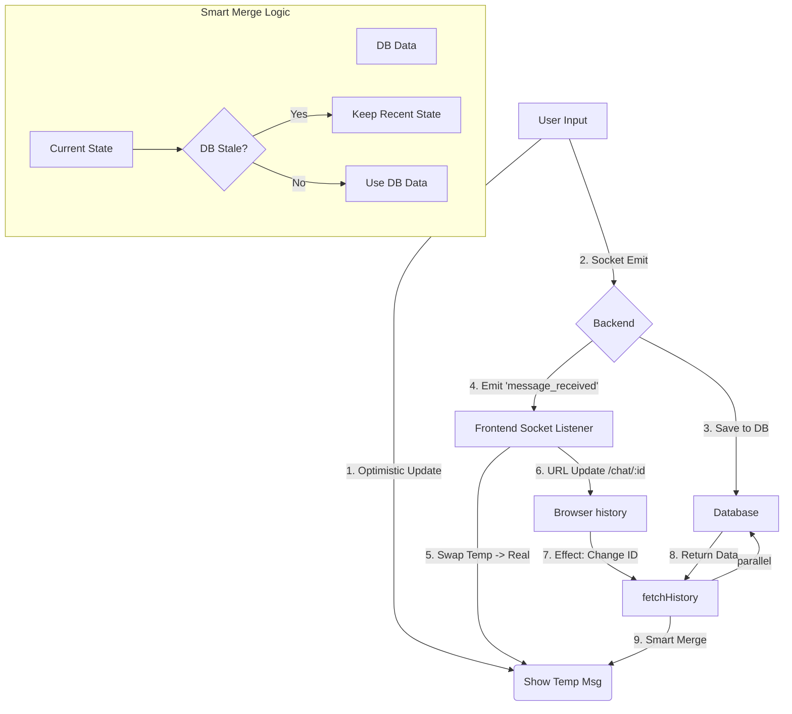

# Ellavox Chat System: End-to-End Message Flow Architecture

This document details the complete lifecycle of a chat message within the Ellavox application, explaining how state, sockets, and the database interact to provide a glitch-free, real-time experience.

## 1. Initiation (User Action)
**Trigger**: User types a prompt and hits Enter **OR** clicks a "Suggested Query" button.
**Function**: `sendMessage(content)` inside `ChatContext.jsx`.

### Step 1.1: Chat ID Resolution
*   **Scenario A (Active Chat)**: We use the `currentChatId` from the state (e.g., `chat_123`).
*   **Scenario B (New Chat)**: If `currentChatId` is `null` (Root URL `/`), we generate a temporary random ID locally (e.g., `abc-xyz`) to keep the socket alive, but the *definitive* ID will come from the backend later.

### Step 1.2: Optimistic UI Update
Before sending anything to the server, we update the UI immediately to feel "snappy".

1.  **Generate Temp ID**: `temp-` + timestamp.
2.  **Create Message Object**:
    ```javascript
    {
        _id: 'temp-1768...',
        content: "User input text",
        role: "user",
        status: "sending"
    }
    ```
3.  **State Update (The First De-duplication)**:
    *   We inspect `prevMessages`.
    *   **Check**: Is there already a `temp-` message with the *exact same* content?
    *   **Action**: If yes, ignore (prevents double-submits from rapid clicks). If no, append to `messages` array.

---

## 2. Server Transmission (Socket Layer)
**Action**: Frontend emits `socket.emit('send_message', { content, chatId })`.


### Step 2.1: Backend Processing (`chat.controller.js`)
1.  **Receive**: Server accepts the payload.
2.  **Persist**: Saves the User Message to MongoDB (`Message.create`).
    *   *Note*: This generates the **Real DB ID** (e.g., `65a1b...`).
3.  **Confirm**: Emits `message_received` event back to the client immediately. This payload contains the *real* message object from the DB.

---

## 3. Synchronization (The "Handshake")
**Action**: Frontend listens for `message_received` event.

This is the critical phase where most race conditions occur. We handle them as follows:

### Step 3.1: URL & Session Sync (New Chat Only)
*   **Condition**: If `currentChatId` is `null` (Frontend thinks we are in "New Chat") **BUT** the incoming message has a valid `chatId`.
*   **Action**:
    1.  `setCurrentChatId(newMessage.chatId)`
    2.  **Silent Navigation**: `window.history.pushState(..., '/chat/<NEW_ID>')`.
    *   *Result*: The URL updates without reloading the page. The user is now "locked in" to this new conversation.

### Step 3.2: Reconciling the Message (The Swap)
We need to turn the "Temporary" message into the "Real" message without making it jump or duplicate.

1.  **Search**: We look for a message in our state that starts with `temp-` AND matches the content.
2.  **Swap**:
    *   **Found**: We replace the `temp` object with the `real` object from the server.
    *   **Not Found**: We append the `real` object (this handles cases where the optimistic update might have failed).
3.  **Safety Check**: Before appending, we verify `prevMessages` doesn't *already* contain this Real ID (handling rare double-event firings).

---

## 4. AI Processing & Streaming
**Action**: Backend calls OpenRouter API (LLM).

### Step 4.1: The Stream
1.  **Backend**: Receives chunks of text from AI.
2.  **frontend event**: `chat_chunk_<UserId>`.
3.  **Frontend Logic**:
    *   **First Chunk**:
        *   Checks: Do we have a message with `streaming: true`?
        *   Action: No? Create a new message: `{ _id: 'streaming-...', role: 'assistant', isStreaming: true }`.
    *   **Subsequent Chunks**:
        *   Finds the message with `isStreaming: true`.
        *   Appends `data.content` to `message.content`.

---

## 5. History Fetching (The "Anti-Glitch" Layer)
**Trigger**: When the URL changes (e.g., usually immediately after **Step 3.1**).
**Function**: `fetchHistory(chatId)`.

This runs in *parallel* with the live socket events, creating a race condition (DB Fetch vs. Live Socket).

### Step 5.1: The Race Condition Problem
*   **Scenario**: The DB Fetch returns an *Empty List* because the database write is milliseconds slower than the URL update.
*   **Result**: The UI wipes blank, deleting the message you just sent. **(BAD)**

### Step 5.2: The Solution (Smart Merge)
When `fetchHistory` returns data, we don't just overwrite the state. We perform a **Smart Merge**:

1.  **Deduplicate**:
    *   Compare `DB Messages` vs `Local Temp Messages`.
    *   If a DB message matches a Temp message, **remove the Temp message** (Server is strict source of truth).
2.  **Preserve ("Anti-Glitch")**:
    *   We look at the *current* state.
    *   **Condition**: Are there "Real" messages (not temp) created in the last **10 seconds** that are **MISSING** from the DB fetch?
    *   **Action**: If yes, we **assume the DB is stale** and we force-keep those recent messages.
    *   *Why*: This protects the message displayed via Socket (Step 3.2) from being deleted by a slow DB query.

---

## 6. Finalization
1.  **Backend**: Stream finishes. Saves AI process to DB. Emits `finished: true`.
2.  **Frontend**:
    *   Sets `isStreaming: false`.
    *   Updates the Assistant Message ID to the final DB ID.
    *   Calls `fetchSessions()` to update the Sidebar list.

## System Diagram (Logic Flow)


