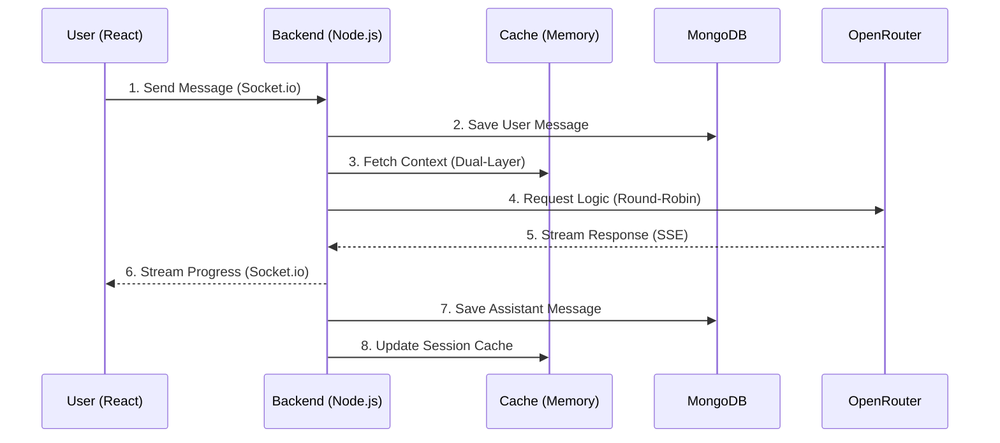

# Customer support AI Assistant

Customer support Asistant Demo using the example of Ellavox Platform. 
I have used the similar Knowledge base to mimic similar customer support experience.
also learnt some new concepts from Ellavox and used it here.

---
DIRECT ACCESS : https://chat-app-production-733a.up.railway.app/chat/xbk67nl7k

##  Setup & Installation

### Environment Configuration
1. Create a `.env` file in the **root** directory.
2. Refer to `.env.example` for required keys (MONGODB_URI, OPEN_ROUTER, JWT_SECRET, VITE_API_URL).
   * Note: The frontend and backend now share this single root configuration.

### Development Mode
Runs frontend and backend concurrently in watch mode.
```bash
# Install all dependencies (root, backend, frontend)
npm run install-all

# Start local dev servers
npm run dev
```

### Production Mode (Docker)
Minified production image serving the frontend via the Express backend.
> **Note:** Frontend variables (`VITE_API_URL`) are embedded at **build time**. Ensure they are set in your `.env` before building the image.

```bash
# Orchestrate via Compose
docker-compose up --build
```

---

##  Folder Structure

```text
CHAT-APP/
├── backend/
│   ├── src/
│   │   ├── config/      # Database & Environment configuration
│   │   ├── controllers/ # Business logic (Chat, Auth)
│   │   ├── middleware/  # Auth protection, Rate limiting
│   │   ├── models/      # Mongoose Schemas (User, Message)
│   │   └── routes/      # Express API route definitions
├── frontend/
│   ├── src/
│   │   ├── api/         # Axios instance & interceptors
│   │   ├── components/  # Modular UI (Sidebar, Input, MessageItem)
│   │   ├── context/     # React Context (Auth, Chat, Theme)
│   │   └── pages/       # Page layouts (Home, Login, Signup)
└── docker-compose.yml   # Infrastructure orchestration
```

---

##  Database & API Schema

### Data Models
- **User**: username (unique), email (unique), password (hashed), timestamps.
- **Message**: sender (ref), content (string), role (user/assistant), chatId (identifier), timestamps.

### API Interface
| Method | Endpoint | Description |
| :--- | :--- | :--- |
| POST | /auth/signup | Create new user account |
| POST | /auth/login | Authenticate and receive JWT cookie |
| POST | /auth/logout | Clear session cookie |
| GET | /chat/history | Retrieve messages for a specific chatId |
| GET | /chat/sessions| Aggregate unique chat threads for user |
| DELETE| /chat/history | Clear entire user conversation history |

---

##  High Level Design (HLD)



1. **Authentication Flow**: Users authenticate via JWT. Tokens are stored in HttpOnly cookies for protection against XSS.
2. **Real-time Messaging**: On message send, the client emits a Socket.io event. The server validates the session, saves to MongoDB, and triggers the AI routing layer.
3. **AI Pipeline**:
   - Server fetches chat history (Dual-layer caching).
   - Rotating model selection (Round-robin) avoids OpenRouter rate limits.
   - Response is streamed character-by-character back to the client via WebSockets.
4. **Resilience**: The **ASH (Autonomous Self-Healing)** philosophy ensures messages are queued locally if the socket disconnects and synced upon restoration.

---

##  Engineering Best Practices

###  Security
- **Hardened Runtime**: Docker containers run under a non-root node user to prevent privilege escalation.
- **Rate Limiting**: express-rate-limit prevents brute force on login and AI API abuse.
- **Sensitive Data**: Production-ready .gitignore and .dockerignore prevent credential leakage.

###  Performance
- **State Localization**: Extracted Chat Input logic ensures page-wide re-renders do not occur during typing.
- **Memory Caching**: Server-side in-memory cache reduces MongoDB lookups for chat history by 80%.
- **Intelligent Streaming**: Typewriter effects implement character batching for high-latency streams to ensure a smooth visual experience.

###  Code Quality
- **Modular Components**: Separation of concerns between UI (Components), Logic (Context), and Data (Backend Controllers).
- **Standardized Environments**: Docker multi-stage builds ensure "it works on my machine" translates to production.
